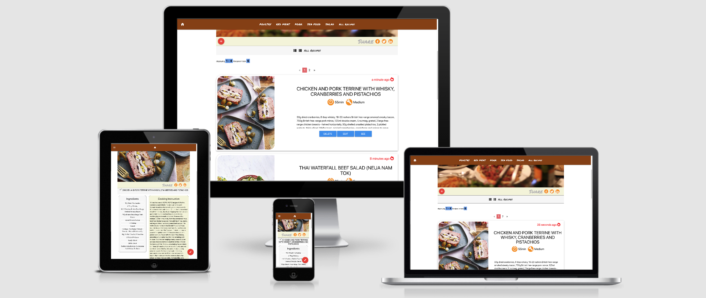

# Milestone Project 3

# Recipes Website

Dynamic RECIPES WEBSITE with an interctive design which contains from fron-end and back-end giving the ability to add, edit, update, delete the recipes simply and easy, just filling the form, or modifyieng the form. It ueses mongoDB and written using Flask Micro Framework, HTML5, CSS3, jQuery, Javascript
Hosted on [Heroku](https://cookbook-ms3.herokuapp.com/)
Repository on [GitHub](https://github.com/rimantascode/MS3-cookbook)

## License

The project is shared for use with the [GNU General Public License v3](https://github.com/Pattern-Projects/oireachtas-ifd-project/blob/master/LICENSE)

This program is free software: you can redistribute it and/or modify
it under the terms of the GNU General Public License as published by
the Free Software Foundation, either version 3 of the License, or
(at your option) any later version.

# UX

## The Aim.

 - The main aim was to create the recipes website with clearly desplayed and  - easily diegstible information. 

 - To create an easy menageble website with an functions such as add, edit and delete the recipes. 

 - Let the users to filter the result by clicking the navigation category.

 - Keep the recipes in sorted by the date when it was added so the users could see the newest recipes. 

## User Stories

When the user lands in the page he sees all of the recipies added.

The user can use the navigation to filter the search results.

the search results are displayed in cards and contains two buttons - View The Recipe - and - Edit.

when the users click on View The Recipe in another page in detail. The requireded and the cooking instruktion will be desplayed. In the right bottom corner us a float button giving an apportunity ti delete, edit, or add a new recipe.

The users also are able to edit the existing recipe by clickig edit button straight on the card.

---

## Design

- The navigation was used from materialize website, as it functioning well on smaller devices and bigger screens.
- The layout of the main page consist of the picture area, in landing page it displayes the general picture with a lot of recipes on the page. When the recipee is viewed than the appropriate picture takes the place. The design like this is consistant and the user do not need to learn how to use it. Down below is a float botton to add the recipe and on the appoiste side share button to allow the user share the recipe/recipes in the Social Media.
- The next pannel has displays the informamtion what is it going to be desplayed, and the title channges in the name of the recipe, when the recipe is view in details. It keeps the information tidy for the user convieniance.
- Down below the recipes are displayed in the cards as search results. First I designed to be displayed a bit differently, but designed it as it is now, because I believe that the picture is worth hundred of words, the size it is displayed make a good cence of the dish. The card it self contains easy diegestible, and usefull information in first glance which might lever the dicision to click the particular recipe.
- At the end of the page we have a footer with links to social media, about us page and contact us page.

- **About Us** simple page with a picture and some text about the project.
- **Contact Us** the design of this page remains simple containing a form, and once it is filled up and meets the requirements can be submited and the user will get a feedback whether it was successfully sent or not.

* Colour scheme consists of few colours, was used website to blend the colors.
  ##############################################################################
  (https://meyerweb.com/eric/tools/color-blend/#:::hex)
  -  `#f7f7f7`
  -  `#964600`
  -  `#666666`
  -  `#ffffff`
  -  `#f5f5dc`
  -  `#ff9900`
  -  `red`
  -  `#edebeb`
  -  `black`
  -  `#008464`
  -  `#0761afb3`
  -  `#ec373780`
  -  `#6aa6ed`

## Typography

- fonts used throughout the website
font-family: "Permanent Marker", cursive
font-family: "Roboto", sans-serif

### Mockups

The website looks a litle bit deffrent than in the mockup. Does not contain the about us and contact us page as it is very simple and the struckture remained the same execp the form and a text in teh about us page.

- [Mockup](https://www.figma.com/file/qRXUafOtVvw52gEOa81RPL/Untitled?node-id=0%3A1)

## Features

Features planned, implemented and outlined for later development

### Planned Features

- Documentation - ReadMe File, Licence & Mockups
- Colour Scheme
- materializecss - HTML, CSS Framework
  - Grid System - Columns and Rows
- Responsive design - Mobile First
- Authentication
- Logo
- UX elements
- Accesibility
- Contact Form
- Git - Version Control System
- GitHub - Remote Repository
- Deployed - Hosted on Github Pages

### Existing Features

- Documentation - ReadMe File, Licence & Mockups
- Displayes the period of time when the recipe was added
- Colour Scheme
- materializecss - HTML, CSS Framework
  - Grid System - Columns and Rows
- Responsive design - Mobile First
- UX elements
- Accesibility
- Gitpod - Version Control System
- GitHub - Remote Repository
- Deployed - Hosted on Github Pages

### Features Left to Implement/fix

- Authentication
- custom logo

## Technologies Used 

This project makes use of:

- [HTML](https://developer.mozilla.org/en-US/docs/Web/HTML)
  - **HTML** for strucutre
- [CSS](https://developer.mozilla.org/en-US/docs/Web/CSS)
  - **CSS** for Styling
- [JavaScript](https://simple.wikipedia.org/wiki/JavaScript)
  - **JS** for creating dynamic functions, manipulating google places api.
- [jQuery](https://en.wikipedia.org/wiki/JQuery)
  - **jQuery** very usefull for traversing and events handeling
- [Google Chrome](https://www.google.com/chrome/)
  - Used for browsing and dev tools
- [Mozilla Firefox](https://www.mozilla.org/en-US/firefox/new)
  - Used for browsing and testing responsiveness.
- [Google](https://www.google.com/)
  - **Google** was used for research, workm and testing responsiveness
- [materializecss.com](https://materializecss.com/)
  - HTML and CSS Framework from **materializecss.com v1.0.0 ** and **jQuery code**
- [Gitpod](https://www.gitpod.io/)
  - **Git** used for Version Control
- [GitHub](https://github.com/)
  - Repository hosted on **GitHub**
- [Heroku](https://dashboard.heroku.com/apps)
  - Website hosted on **Github Pages**
- [Am I Responsive](http://ami.responsivedesign.is)
  - Testing responsiveness of the website **Am I Responsive**
- [Figma](https://www.figma.com/)
  - used to make a mockup
- All the labraries including the flask micro Framework have to installed. All of them is listed in the requirements.txt, how to install please Deployment section.

### Manual Testing

- All the links work, tested by clicking manualy. 
- add button works, it once clicked it takes to Add Recipe page. 
- share links all works it is easy to share the website. 
- pagianton works, it desplays 4 recipes per page.
- The feature the time of period when the recipe was added works, and tested by adding a new recipe. 
- DELETE, EDIT, SEE buttons work and the card, tested manualy at takes to the correct page.
- links in footer work, takes to the correct pages.

### Code Validation

To validate the my CSS and HTML code I used [https://validator.w3.org/](https://validator.w3.org/) 

To validate the PYTHON3 code [http://pep8online.com/ch/eckresult](http://pep8online.com/ch/eckresult) 

### Testing on Browsers

Tested on Google Chrome, Opera, Mozzilla firefox. No issues.

### Testing on Devices

Used Google Chrome, Opera, Mozila firefox browser to test the responsiveness, it flows good on any type of device.

## Deployment

The process involved:

- Host a git repository on GitHub. Explained [here](https://help.github.com/en/articles/create-a-repo).
- The root folder contains README.md and index.html files
- On GitHub repository settings page move to GitHub Pages section
- Change source to master branch. (Or any desired branch)
- Provided link will be your projects home (index) page.

To deploy your own version of the website:

- Have git installed
- Visit the [repository](https://github.com/rimantascode/MS3-cookbook)
- Click 'Clone or download' and copy the code for http
- Open a terminal in your root directory
- Type 'git clone ' followed by the code taken from github repository
- `git@github.com:rimantascode/MS3-cookbook.git`
- You will need to install requirements.txt by typing in the terminal pip3 install -r requirements.txt

- When this completes you have your own version of the website
  - Feel free to make any changes to it
- The website can be run by opening one of the HTML files within a web browser
- Visit the link provided
- Your website with any made changes will appear
- Saved changes to the website will appear here after refreshing the page

The benefits of hosting your website on GitHub pages is that any pushed changes to your project will automatically update the website. Development branches can be created and merged to the master when complete.

It may take a moment for changes to appear on the hosted website.

## Credits

### Media

### Acknowledgements

Thank you inspiration, very usefull guidence and tips:

- Seun Owonikoko @seun_mentor
- Code Institute
